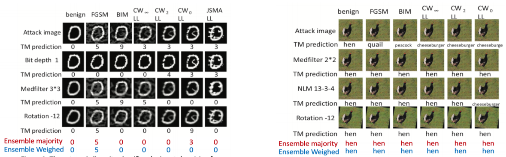
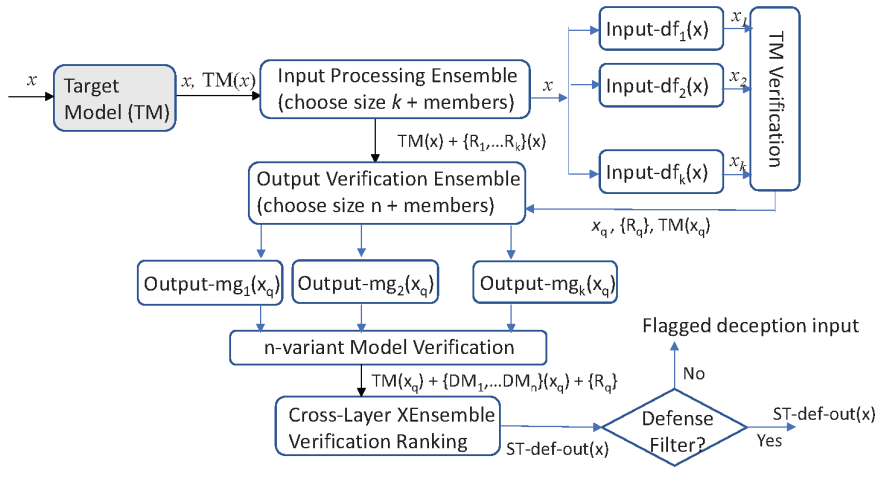

## Introduction

XEnsemble is an advanced robust deep learning ensemble package that can verify and correct adversarial examples and identify out-of-distribution inputs for deep learning. The intuition behind is the input divergence and the model divergence of these outlier inputs.

XEnsemble now supports four datasets: MNIST, CIFAR-10, ImageNet and LFW.


##  Examples

### model divergence


### instance divergence




### XEnesmble overview



## Requirement and How to run
Please refer to the [README](https://github.com/WenqiWei789/XEnsemble-1.0) file.

## publications
Our XEnsemble idea have generated a number of publications on deception input characterization, deception mitigation for deep learning and ensemble methods.


### XEnsemble as a defense for adversarial example & OOD inputs
```
- Wei, Wenqi, and Ling Liu. "Robust Deep Learning Ensemble against Deception." IEEE Transactions on Dependable and Secure Computing (2020).
- Wei, Wenqi, Ling Liu, Margaret Loper, Ka-Ho Chow, Emre Gursoy, Stacey Truex, and Yanzhao Wu. "Cross-layer strategic ensemble defense against adversarial examples." In 2020 International Conference on Computing, Networking and Communications (ICNC), pp. 456-460. IEEE, 2020.
- Liu, Ling, Wenqi Wei, Ka-Ho Chow, Margaret Loper, Emre Gursoy, Stacey Truex, and Yanzhao Wu. "Deep neural network ensembles against deception: Ensemble diversity, accuracy and robustness." In 2019 IEEE 16th International Conference on Mobile Ad Hoc and Sensor Systems (MASS), pp. 274-282. IEEE, 2019.
- Chow, Ka-Ho, Ling Liu, Wenqi Wei and Yanzhao Wu. "Diverse and Robust Neural Ensembles against Adversarial Examples." IEEE Transactions on Dependable and Secure Computing (2021).
- Chow, Ka-Ho, Wenqi Wei, Yanzhao Wu, and Ling Liu. "Denoising and verification cross-layer ensemble against black-box adversarial attacks." In 2019 IEEE International Conference on Big Data (Big Data), pp. 1282-1291. IEEE, 2019.
```

### Characterization of adversarial example
```
- Wei, Wenqi, Ling Liu, Margaret Loper, Ka-Ho Chow, Mehmet Emre Gursoy, Stacey Truex, and Yanzhao Wu. "Adversarial Deception in Deep Learning: Analysis and Mitigation." In 2020 Second IEEE International Conference on Trust, Privacy and Security in Intelligent Systems and Applications (TPS-ISA), pp. 236-245. IEEE, 2020.
- Wei, Wenqi, Ling Liu, Margaret Loper, Stacey Truex, Lei Yu, Mehmet Emre Gursoy, and Yanzhao Wu. "Adversarial examples in deep learning: Characterization and divergence." arXiv preprint arXiv:1807.00051 (2018).
```

### Ensemble methodology
```
- Yanzhao Wu, Ling Liu, Zhongwei Xie, Ka-Ho Chow, and Wenqi Wei. "Boosting Ensemble Accuracy by Revisiting Ensemble Diversity Metrics", IEEE Conference on Computer Vision and Pattern Recognition (CVPR 2021), 2021
```


We are continuing the development and there is ongoing work in our lab regarding adversarial attacks and defenses and out-of-distribution input detections. If you would like to contribute to this project or have any questions, please contact [Wenqi Wei](https://www.cc.gatech.edu/~wwei66/).


## Acknowledgement
The attack code package is built on top of the EvadeML. We specially thank the authors. We also thank authors in Cleverhans, Carlini&Wagner attacks, PGD attacks, MagNet, universal(and DeepFool) attacks, keras models and those impletmented neural network models with trained weights.


<!--
this page is https://wenqiwei789.github.io/XEnsemble_project/


```markdown
Syntax highlighted code block

# Header 1
## Header 2
### Header 3

- Bulleted
- List

1. Numbered
2. List

**Bold** and _Italic_ and `Code` text

[Link](url) and 
```

For more details see [GitHub Flavored Markdown](https://guides.github.com/features/mastering-markdown/).

-->
